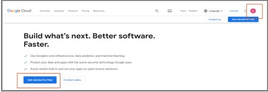
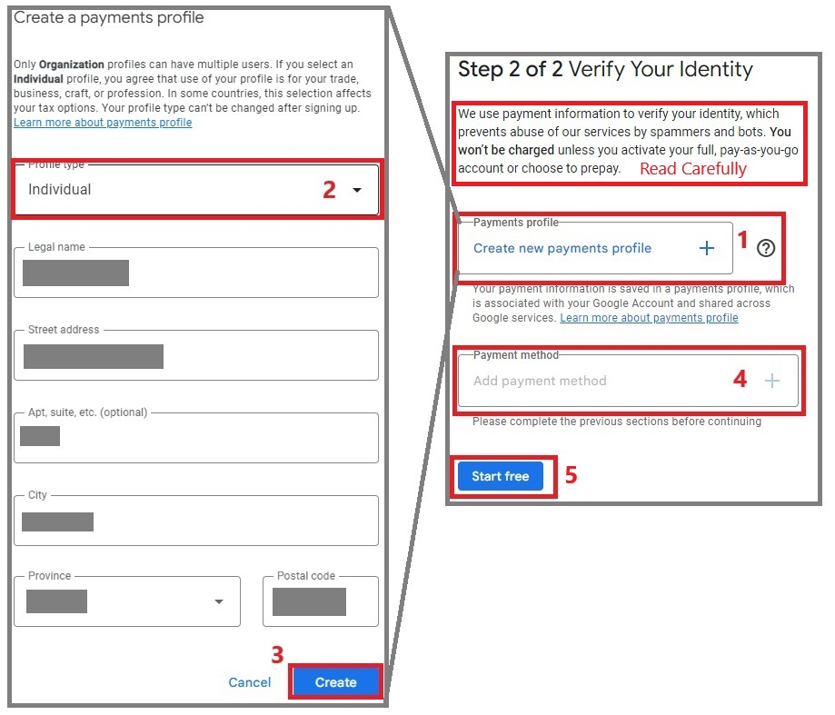
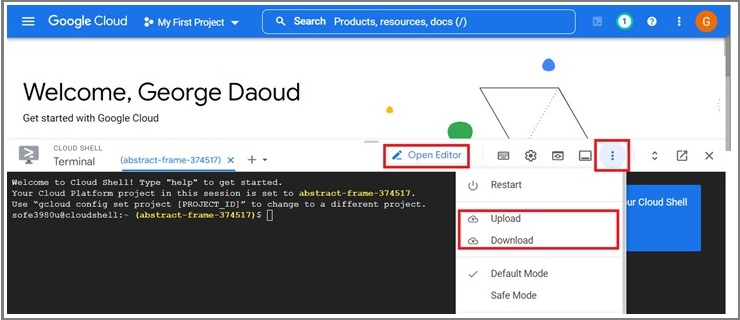

#Lab 1: Data Ingestion System (Apache Kafka)

## What’s Kafka?
1.	Watch the following video about [Event Driven Architecture (EDA)](https://www.youtube.com/watch?v=o2HJCGcYwoU)
2.	The core component of an EDA is the Data Ingestion System also known as Publisher/subscriber (pub/sup). 
Kafka is one of the most frequent used pub/sub. Watch the following video to get a good understanding of [Kafka and its terminologies](https://www.youtube.com/watch?v=Ch5VhJzaoaI).
3.	You can set up Kafka cluster on a set of locally connected computers, 
deploy it as a set of docker images over Kubernetes cluster, or use already exists cloud-native service. 
In this section, we will use Kafka confluent Cloud as a cloud-native service. It’s a tool that can integrate with any cloud platform 
like Google Cloud Platform (GCP) to create a Kafka cluster. Thus, we will start by creating a GCP account.  

## Creating GCP account
1.	It’s recommended to create a new Gmail account, but you can use an already existing account.
2.	Go to [GCP official site](https://cloud.google.com/gcp). Be sure that you are using the correct account. Then, click on **Get Started for free** button 

3.	Fill the account information and accept the terms of services

4.	In the next step, you will fill in your personal information and a credit card information. That information is to ensure that you are a real person. This will create a free account for 90 days and give you 300+ $ free credits. **No charges are made unless you upgrade to a paid Cloud Billing account**. Please read [the GCP billing verification](https://cloud.google.com/free/docs/free-cloud-features#billing_verification) for more information.

5.	Fill in the final survey. Then, click **Done**. You can safely skip any given offers.

6.	Get yourself familiar with
* Dashboard: allows you to search and select available cloud services
* project(s): a project usually named **My First Project** will be created but we can create, edit, and delete projects.
* The console: By clicking the console icon, the console will be opened to you. The console is a Linux terminal that can be used to configure the cloud. Any commands that affect the console local OS will be temporary and lost whenever the session is closed while any change made to any cloud services will be permanent.  
  
The console will be opened at the bottom of the page as shown in the following figure and from it we can exchange files and folders with your local computer by downloading or uploading them. You can also click **Open Editor** button to open the editor.
   
* Editor: It’s a text editor that allows you to edit plain text file as shown in the following figure. You can switch back to the console by clicking **Open Terminal** button
 
