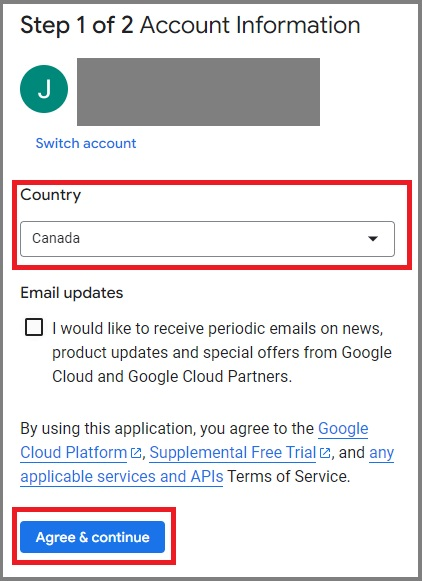
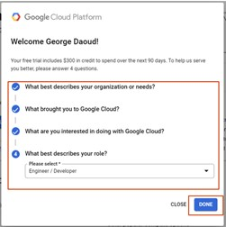

# Milestone 1: Data Ingestion System (Apache Kafka)
## Repository: 
[https://github.com/GeorgeDaoud3/SOFE4630U-MS1](https://github.com/GeorgeDaoud3/SOFE4630U-MS1)
## Objectives
1.	Understand the role of Data Ingestion System in Event Driven Architecture.
2.	Get familiar with Google Pub/Sub and its terminologies. 
3.	Be able to create topics, producers, and consumers via GUI and code.

## What’s Kafka?
1.	Watch the following video about [Event Driven Architecture (EDA)](https://www.youtube.com/watch?v=o2HJCGcYwoU)
2.	The core component of an EDA is the Data Ingestion System also known as Publisher/Subscriber (Pub/Sup). 
Kafka is one of the most frequent used pub/sub. Google Cloud PLatform (GCP) has it's own data ingestion service. called  Cloud Cloud Pub/Sub. Watch the following video to get a good understanding of [the Cloud Pub/Sub and its terminologies](https://www.youtube.com/watch?v=MjEam95VLiI).

We will start by creating a GCP account.  

## Creating GCP account
1.	It’s recommended to create a new Gmail account, but you can use an already existing account.
2.	Go to [GCP official site](https://cloud.google.com/gcp). Be sure that you are using the correct account. Then, click on **Get Started for free** button  

  

3.	Fill the account information and accept the terms of services  

  

4.	In the next step, you will fill in your personal information and a credit card information. That information is to ensure that you are a real person. This will create a free account for 90 days and give you 300+ $ free credits. **No charges are made unless you upgrade to a paid Cloud Billing account**. Please read [the GCP billing verification](https://cloud.google.com/free/docs/free-cloud-features#billing_verification) for more information.  

  

5.	Fill in the final survey. Then, click **Done**. You can safely skip any given offers.  

  

6.	Get yourself familiar with
* Dashboard: allows you to search and select available cloud services
* project(s): a project usually named **My First Project** will be created but we can create, edit, and delete projects.
* The console: By clicking the console icon, the console will be opened to you. The console is a Linux terminal that can be used to configure the cloud. Any commands that affect the console local OS will be temporary and lost whenever the session is closed while any change made to any cloud services will be permanent.  
 

The console will be opened at the bottom of the page as shown in the following figure and from it we can exchange files and folders with your local computer by downloading or uploading them. You can also click **Open Editor** button to open the editor.  


* Editor: It’s a text editor that allows you to edit plain text file as shown in the following figure. You can switch back to the console by clicking **Open Terminal** button  


# Create a Confluent Kafka Cluster
1.	Open [the Confluent Cloud-native Service for Apache Kafka](https://www.confluent.io/confluent-cloud/). Then click **TRY FREE**.  

  

2.	Sign in with the same Google account  

  

3.	Enter your personal Information. Then, click **Submit**  

  

4.	Finish the following survey and click **Continue**.  
5.	To create your first Kafka cluster, choose the cluster name (e.g. **sofe4630u**) and Google Cloud as the service provider, Toronto as a **Region**. Then press **Continue**.   

  

6.	Don’t enter the payment info.   

  


## Create a topic, producer and consumer using the GUI
1.	Go to [the Confluent Kafka home page](https://confluent.cloud/home).
2.	Click **Environments**.  
3.	Select the default environment.  

     

4. Keep the current free  configuration

   
   
6.	Select the cluster according to its name.  

     

6.	Create a topic by selecting **topics**. Then click on **Create topic**.  

     

7.	Choose the topic name as **testTopic** and you can leave the number of partitions to the default value of 6. Also, by clicking on **Show advanced settings**. Thus, you can change the **Cleanup policy**, **Retention time**, **Retention size**, and **maximum message size**. For now, you clean leave them with the default values. Finally, click **create with defaults** to create the topic.  

     

8. the values and/or the keys of the messages can be configured to follow a certain schema. To make it simpler in this tutorial, no schemas will be created for the topic. 

     

9.	In the **testTopic** page, create **messages** tap which allows you to produce and consume messages.  

     

10.	Click on **Actions** and then choose **Produce new message** as shown in the previous figure. A default value/key message will be generated for you. 
The value is in a JSON format, but we can change it to a plain string. The key also is a number, but it can also be a string.  
Change the **value** to **“Hello Kafka!!”** and the **key** to **1**. Then click **Produce**.  

     

11.	It will be automatically consumed in the consumer region. The partition will be determined by hashing the key value.  

     

12.	Produce more messages and check them using the consumer. 

## Create a Topic, Producer and Consumer Using Python Code
1.	To create a Kafka client for either a producer or a consumer using a language of your choice. Click **Cluster overview**. Then, at the **Set up client** area, click **Get started**. 

     

2. Click **Set up a new client** to get a template of a given language. Then, choose **Python**  

     

3.The first step is to get an API key for a credential that enables you to connect to the Kafka cluster. Start by clicking **Cluster API key**. Then, click **Create Kafka Cluster API key**.  

     

3.	**API key** and **API secret** will be generated for you. click **Download and continue** to save them locally in your computer. The downloaded file will contain the **Bootstrap server**as well .  

     

4. The following steps choose the required libraries, snippets of python code, and some tutorials. Fell free to go through them. Then click **View Clients**.

5.	On your computer, install the python library  
``` python
pip install confluent-kafka confluent-kafka configparser
```  
6.	Download the files from folder **v1** from the GitHub repository to a certain folder in your computer.  
7.	Edit the cred.json and replace <**Bootstrap servers**>, <**CLUSTER_API_KEY**>, and  <**CLUSTER_API_SECRET**> by the values of the **Bootstrap server**, **API key**, and **API secret** you got in step 4 in this section. Save the file to be used as a credential for the other python scripts.  

     

8.	**createTopic.py** is the script used to create a topic. Edit the file and change the topic name in line 8th from <"**topicname**"> to "**testTopic2**". You can change the default values of the number of partitions and the replication factor at lines 9 and 10. The credential is read from the **cred.json** file according to the python statement in line 7. The **cred.json** and **createTopic.py** should be in the same folder. In line 12, an admin client is created that has the privileged to create topics. The statement in lines 14 to 16 creates an array of new topics that contains only a single topic. The array is passed to a createTopics function to create the topics. The loop starting from line 18 goes through the results of createTopics and prints a summary of the creation results.  

  

Save the file and run it, the output should look like  

  

9.	**producer.py** is a python script that produces messages to a topic. Following the same technique change the topic name in line 8 to **“testTopic2”**. The second marked box in the following figure is a call back function that prints the output of each produce function that sends a message to the Kafka. The code in the third rectangle reads two strings and an integer that represents the key, value and the partition number from the user. Entering any integer less than -1 will stop the loop. The fourth box sends the message via produce function and invokes the call back function using the poll function. The last box flushes the producer internal buffer to ensure that all messages are already sent before ending the program. **Note:** a partition of value of -1 or when it's not included in the produce function, will make kafka decides automatically the paratition number accordinf to a built-in hashing function.  

  

10.	The final script is **consumer.py**. As usual, change the topic name in line 6 to “testTopic2”. The group id is given in the 11th line. Consumers of the same group id will cooperate to read messages from the topic. The group id can be any string. The third rectangle marked in the following figure creates a consumer and subscribes it to the topic. Note, the consumer can subscribe to a set of topics. The poll function at the 23rd line reads messages from the topic. The fifth rectangle marks the code that prints the status and output of the consume function. The last box will end the consumer once **Ctrl-C** is pressed by the user that will trigger the **KeyboardInterrupt**.  

  

## Simulating a Real Meter.

  

1.	Copy the files from **v2** folder from the GitHub repository.
2.	Edit **cred.json** as you did in the previous section.
3.	Edit **createTopic.py** to create a topic called **smartMeter** as you did in the previous section.
4.	Edit **consumer.py** to create a consumer that reads from **smartMeter** topic as you did in the previous section. Leave the file running such that you can consume the messages once they produced to the topic. The only difference in the message get decoded by the **json.loads()** function as the producer will send a JSON object instead of string.
5.	Edit **smartMeter.py** to create to produce smart meter measurements generated randomly. Update the topic name as before to **smartMeter**. The code looks like the same except the lines shown in the following figure. Lines from 12 to 18 have values that will be used to generate messages. Lines 33 till 54 are within a loop that will randomly generate messages that will be sent to the Kafka topic.  
  

## Discussion
* What is EDA? What are its advantages and disadvantages?
* In Kafka, what’s meant by cluster, broker, topic, replica, partition, zookeeper, controller, leader, consumer, producer, and consumer group?

## Design
Google has an alternative ingestion tool called **Google Pub/sub**. Configure it and create a topic using Cloud interface. write a python code for a Google Pub/sub consumer and producer. The producer and the consumer should act as the smart meter shown before. **Note:** they needed a different library than that used for confluent kafka.

## Deliverables
1. A report that includes the discussion and the design parts. 
2. An audible video of about 3 minutes showing the smart meter using confluent cloud Kafka. 
3.  Another  audible  video  of about 5  minutes showing  the  design part. 
